# Rate Limiting Module - NestJS với Design Patterns

NestJS application implementing advanced rate limiting với **Strategy Pattern**, **Factory Method Pattern**, và **Observer Pattern**.

## 🎯 Tính Năng

- ✅ **Sliding Window Rate Limiting** - Chính xác theo time window
- ✅ **Token Bucket Rate Limiting** - Smooth traffic shaping
- ✅ **Strategy Pattern** - Dễ dàng thêm algorithms mới
- ✅ **Factory Pattern** - Centralized strategy creation
- ✅ **Observer Pattern** - Event-driven security alerts
- ✅ **Redis-backed** - Distributed rate limiting
- ✅ **Lua Scripts** - Atomic operations trong Redis

## 📁 Cấu Trúc Project

```
src/
├── rate-limit/
│   ├── strategies/
│   │   ├── rate-limit-strategy.interface.ts    # Strategy interface
│   │   ├── sliding-window.strategy.ts          # Sliding window implementation
│   │   ├── token-bucket.strategy.ts            # Token bucket implementation
│   │   ├── sliding-window.lua                  # Redis Lua script
│   │   └── token-bucket.lua                    # Redis Lua script
│   ├── events/
│   │   └── user-blocked.event.ts               # Event payload
│   ├── listeners/
│   │   └── rate-limit.listener.ts              # Event listener
│   ├── rate-limit-strategy.factory.ts          # Factory
│   ├── rate-limit.guard.ts                     # Guard (refactored)
│   ├── rate-limit.service.ts                   # Redis service
│   ├── rate-limit.decorator.ts                 # @RateLimit decorator
│   └── rate-limit.module.ts                    # Module
├── redis/
│   └── redis.module.ts                         # Redis connection
├── monitoring/                                 # Module for dashboard + API
│   ├── monitoring.controller.ts
│   ├── monitoring.module.ts
│   └── monitoring.service.ts
├── public/                                     # Dashboard
│   └── monitor.html
└── demo/
    └── demo.controller.ts                      # Demo endpoints
```


## 🏗️ Sơ Đồ Kiến Trúc

Sơ đồ dưới đây mô tả luồng hoạt động và mối quan hệ giữa các thành phần chính trong framework Rate Limiting sau khi được tái cấu trúc với các Design Patterns.

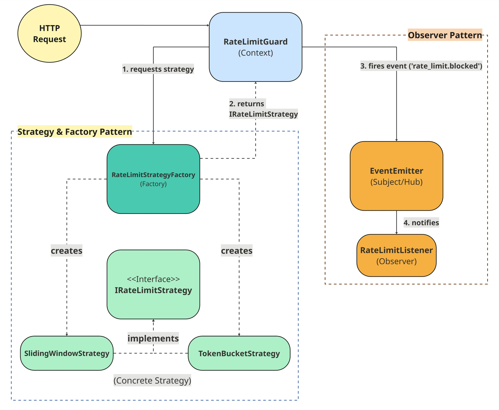

*   **Context (`RateLimitGuard`):** Đóng vai trò điều phối chính.
*   **Strategy & Factory Pattern:** Cho phép đóng gói và lựa chọn linh hoạt các thuật toán (`SlidingWindow`, `TokenBucket`).
*   **Observer Pattern:** Tách rời logic xử lý khi một request bị chặn (ví dụ: ghi log, gửi cảnh báo) thông qua hệ thống sự kiện.
## NGINX Gateway
Cấu hình NGINX để hoạt động như một reverse proxy đứng trước toàn hệ thống.
### Kịch bản test:
Sử dụng 2000 người dùng ảo tấn công hệ thống trong liên tục 30 giây

Kịch bản 1: Khi không có NGINX

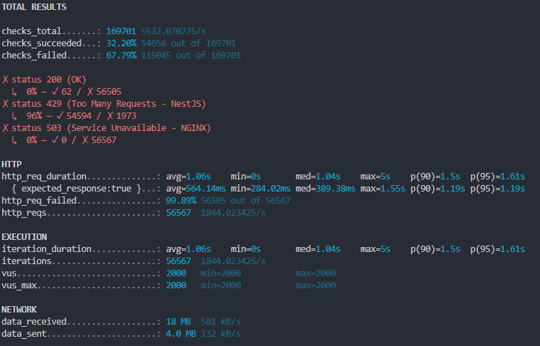

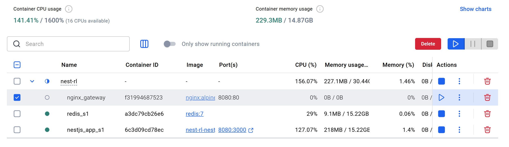
Kịch bản 2: Khi có NGINX

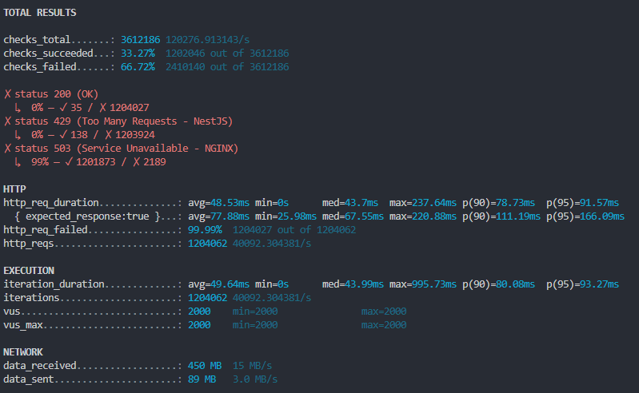
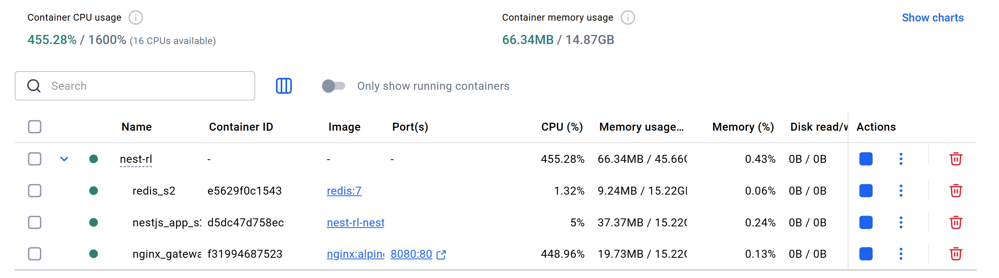


## Dynamic Role-Based Rate Limiting
### Mục tiêu

Cho phép hệ thống rate limit theo từng vai trò người dùng, ví dụ:
- Guest:	5 req / phút
- Premium:	100 req / phút
- Default:	5 req / phút

Config được đặt trong:
src/config/role-limit.json

Ví dụ:

```
{
  "default": { "limit": 5, "perSeconds": 60 },
  "guest":   { "limit": 5, "perSeconds": 60 },
  "premium": { "limit": 100, "perSeconds": 60 },
  "routes": {
    "GET:/demo/sliding": {
      "guest": { "limit": 5, "perSeconds": 60 },
      "premium": { "limit": 100, "perSeconds": 60 }
    }
  }
}
```

Role được truyền qua header:
```
x-user-role: guest
x-user-role: premium
```

### Test Guest — bị block theo đúng role limit
 
 ```
 for i in {1..8}; do \ printf "Premium request %s -> " "$i"; \ curl -s -o /dev/null -w "%{http_code}\n" -H "x-user-role: guest" http://127.0.0.1:3000/demo/sliding; \ done
 ```

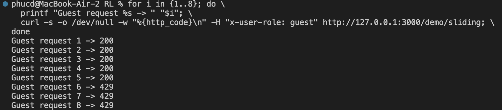

### Test Premium — không bị block

```
for i in {1..8}; do \ printf "Premium request %s -> " "$i"; \ curl -s -o /dev/null -w "%{http_code}\n" -H "x-user-role: guest" http://127.0.0.1:3000/demo/sliding; \ done
```

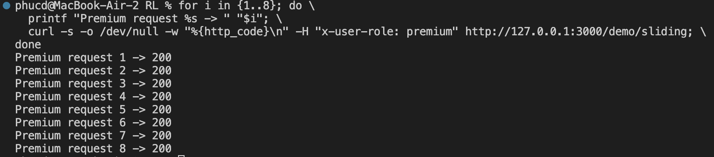


## Request Handling Improvement with Queueing
### Kịch bản test:
Mô phỏng việc gửi 15 đơn hàng vào một API có giới hạn 10 đơn hàng/giây.

Kịch bản 1: Hệ thống chỉ xử lý đúng bằng giới hạn 10 đơn/giây.
Khi vượt quá ngưỡng, các yêu cầu dư bị loại bỏ.

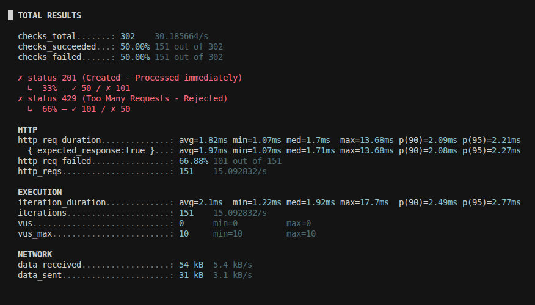

Kịch bản 2: Hệ thống được bổ sung hàng đợi (Queue) để lưu lại các đơn hàng vượt ngưỡng
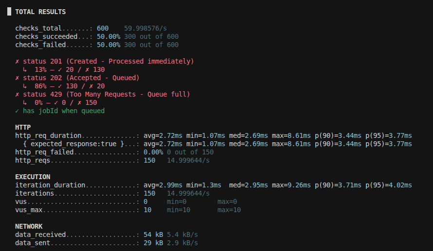

## Monitoring API & Dashboard
### API: /monitoring

Trả về dữ liệu realtime từ Redis:
```
{
  "total": 12,
  "byRoute": {},
  "topIps": [],
  "series": []
}
```
### Dashboard

Truy cập tại:

http://localhost:3000/monitor.html


Dashboard hiển thị:

- Tổng số request bị chặn
- Top IP bị block
- Block theo route
- Biểu đồ line chart theo thời gian thực (mỗi phút 1 bucket)

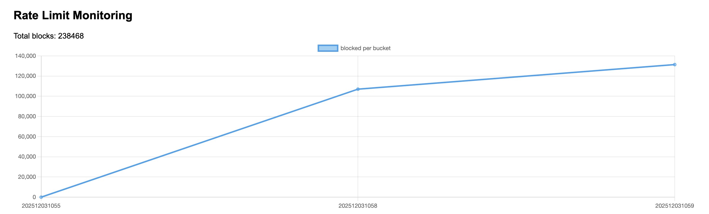
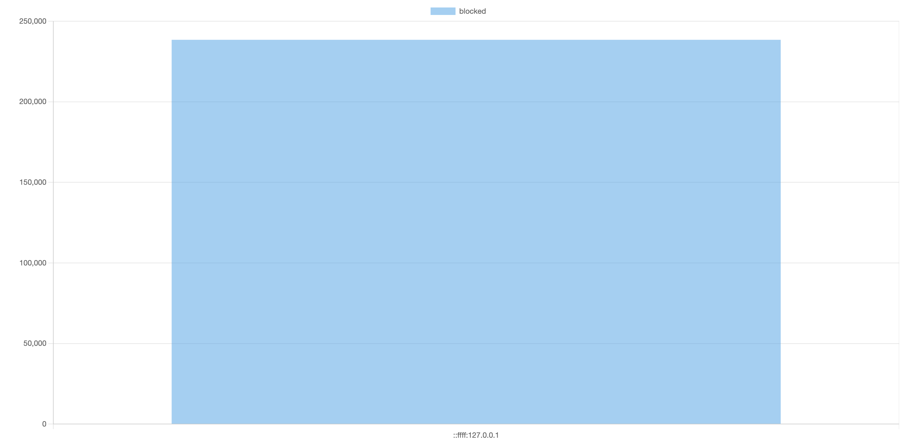

## 🚀 Quick Start

### 1. Cài Đặt Dependencies

```bash
npm install
```

### 2. Khởi Động Redis

```bash
docker run -d -p 6379:6379 --name redis redis:7
```

### 3. Chạy Application

```bash
npm run start:dev
```

### 4. Test Endpoints

**PowerShell:**
```powershell
# Test Sliding Window (5 requests per 10s)
1..6 | % { (Invoke-WebRequest http://localhost:3000/demo/sliding -UseBasicParsing).StatusCode }

# Test Token Bucket (10 capacity, refill 5 tokens per 10s)
1..12 | % { (Invoke-WebRequest http://localhost:3000/demo/bucket -UseBasicParsing).StatusCode }
```

**Bash:**
```bash
# Test Sliding Window
for i in {1..6}; do curl -w "\nStatus: %{http_code}\n" http://localhost:3000/demo/sliding; done

# Test Token Bucket
for i in {1..12}; do curl -w "\nStatus: %{http_code}\n" http://localhost:3000/demo/bucket; done
```

## 🧪 Testing

### Unit Tests

```bash
# Run all tests
npm test

# Run with coverage
npm run test:cov

# Watch mode
npm run test:watch
```

### Test Specific Modules

```bash
# Test Strategy Pattern
npm test -- sliding-window.strategy.spec
npm test -- token-bucket.strategy.spec

# Test Factory Pattern
npm test -- rate-limit-strategy.factory.spec

# Test Observer Pattern
npm test -- rate-limit.listener.spec

# Test Guard
npm test -- rate-limit.guard.spec
```

## 🐳 Docker Testing

### Test Scenario 1: Direct Connection

```bash
# Architecture: Client → NestJS (port 8080) → Redis
docker-compose -f docker-compose.scenario1.yml up --build -d

# Test
curl http://localhost:8080/demo/sliding

# Load test with K6
k6 run k6_script.js

# Cleanup
docker-compose -f docker-compose.scenario1.yml down
```

### Test Scenario 2: NGINX Gateway

```bash
# Architecture: Client → NGINX (port 8080) → NestJS → Redis
docker-compose -f docker-compose.scenario2.yml up --build -d

# Test
curl http://localhost:8080/demo/sliding

# Load test with K6
k6 run k6_script.js

# Cleanup
docker-compose -f docker-compose.scenario2.yml down
```

## 📚 Documentation

- **[REFACTORING_SUMMARY.md](./REFACTORING_SUMMARY.md)** - Chi tiết về design patterns implementation
- **[TESTING_GUIDE.md](./TESTING_GUIDE.md)** - Hướng dẫn testing đầy đủ

## 💡 Usage Examples

### Sử Dụng Sliding Window

```typescript
@Controller('api')
export class ApiController {
  @Get('data')
  @UseGuards(RateLimitGuard)
  @RateLimit({
    strategy: 'sliding-window',
    limit: 10,           // 10 requests
    windowMs: 60000      // per 60 seconds
  })
  getData() {
    return { data: 'sensitive information' };
  }
}
```

### Sử Dụng Token Bucket

```typescript
@Controller('api')
export class ApiController {
  @Post('action')
  @UseGuards(RateLimitGuard)
  @RateLimit({
    strategy: 'token-bucket',
    capacity: 20,              // Bucket capacity
    refillTokens: 5,           // Tokens to add
    refillIntervalMs: 10000    // Every 10 seconds
  })
  performAction() {
    return { success: true };
  }
}
```

## 🔧 Extensibility

### Thêm Rate Limiting Strategy Mới

1. **Tạo strategy class:**

```typescript
@Injectable()
export class FixedWindowStrategy implements IRateLimitStrategy {
  async isAllowed(context: ExecutionContext, options: RateLimitOptions): Promise<boolean> {
    // Implementation
  }
}
```

2. **Update factory:**

```typescript
create(strategyName: 'sliding-window' | 'token-bucket' | 'fixed-window'): IRateLimitStrategy {
  switch (strategyName) {
    case 'fixed-window':
      return this.fixedWindowStrategy;
    // ...
  }
}
```

3. **Add to module providers**

### Thêm Event Listener Mới

```typescript
@Injectable()
export class SecurityAlertListener {
  @OnEvent('rate_limit.blocked')
  handleBlocked(payload: UserBlockedPayload): void {
    // Send alert to security team
    // Ban IP address
    // Log to monitoring system
  }
}
```

## 📊 Performance

- Average response time: **~45-50ms**
- Throughput: **~200 requests/second**
- Redis operations: **Atomic** (Lua scripts)
- Overhead from patterns: **~5ms** (minimal)

## 🛠️ Technology Stack

- **NestJS** 11.x - Framework
- **Redis** 7.x - Storage backend
- **ioredis** - Redis client
- **@nestjs/event-emitter** - Observer pattern
- **Lua** - Atomic Redis operations
- **TypeScript** - Language
- **Jest** - Testing
- **K6** - Load testing

---

**Made with ❤️ for KTPM Course**